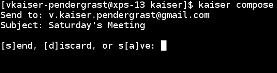
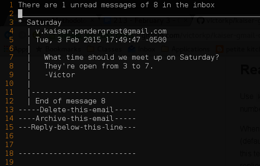

## Kaiser Gmail Client ##
A command line Gmail client that separates email client from text editor - use your favorite text editor to read, write, reply to, and delete messages in your inbox~

## Installation and Uninstallation ##
Run `make install` or `make uninstall` with elevated privileges in order to install.

## Usage ##
kaiser \<compose \| read \<optional number of emails to show\> \| add-account \| remove-account \| list-accounts \| config\>

## Composing a Message ##
Use `kaiser compose` to start writing a message, fill in the receiver address, and the subject field. At this point, your text editor (default vi, see the Config section for how to change this) will open and allow you to type your message. After saving and closing the file, you'll be prompted if you'd like to send, save as a draft, or discard this message.

## Reading, Replying, and Deleting Mail ##
Use `kaiser read`  to display all unread emails you have, or use `kaiser read XXX` where `XXX` is the number of messages to show.

When reading email, everything is displayed as plain text and opened in the text editor of your choice (default editor is vi; use `kaiser config` to change editors). Replying and deleting mail involves editing this text file. Once you've made your edits, make sure to save and close the file in order to have your replies and deletes propagated.

The above screenshot is a sample output of `kaiser read` when using `vim` as the set text editor.

### Replying ###
Simply type your reply between the `Reply-below-this-line` and the `-----` separator lines. When the file is saved and closed, the reply will be sent.

### Deleting and Archiving ###
Delete the `Delete-this-email` or `Archive-this-email` line immediately below the email you wish to delete or archive. When the file is saved and closed, the email will be deleted. Note that you can both reply to and delete/archive an email at the same time.

## Config ##
Kaiser is quite customizeable. By default, the vi editor is used to read and write emails, however you can tell Kaiser to use whatever editor you prefer.

Use `kaiser config` and then one of the following commands to change functionality of Kaiser.

### set-editor ###

Use `kaiser config set-editor \<EDITOR\>` to change the text editor that Kaiser will invoke when reading and writing emails. You can use a terminal-based or a GUI editor - as long as it can write text files, it'll work.
 - Example: `kaiser config set-editor vim`
 - Example: `kaiser config set-editor gedit`.

### set-read-messages ###

Use 'kaiser config set-read-messages \<NUMBER OF MESSAGES\>` to set how many messages to display when using `kaiser read`. You may use `kaiser config set-read-messages 0' to show all the unread messages in your inbox, or use a negative number to show all unread messages plus additional older messages.
 - Example: `kaiser config set-read-messages 5` shows 5 messages when you use `kaiser read`.
 - Example: `kaiser config set-read-messages 0` shows only your unread messages when you use `kaiser read`.
 - Example: `kaiser config set-read-messages -3` shows your unread messages plus three already read messages when you use `kaiser read`.

